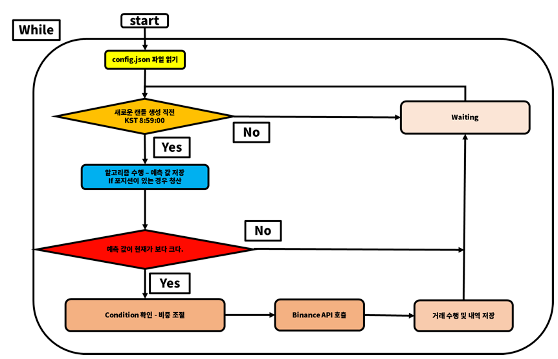

# 트레이딩 봇 사용법

1. config.json 파일에 필수 configuration 항목 기입

   - exchange: 거래를 수행할 거래소 .ex) binance, bybit, ftx
   - api_key: 거래소 계좌 api_key
   - api_secret: 거래소 계좌 api secret key
   - algorithm: 적용할 알고리즘 .ex) arima, lstm, xgboost, lr
   - feature: 해당 알고리즘에 사용할 feature .ex) dollar_exchange
   - condition: 조건으로 설정할 룰베이스 지표 .ex) [], [rsi], [ma], [rsi, ma] ... 
   - ticker: 거래할 티커명 .ex) BTC/USDT
   - balance: 거래할 금액 잔고 .ex) 10000
   - position: 현재 봇 포지션, 초기실행 시 null값으로 설정 .ex) null, long
   - amount: 포지션 사이즈, balance로 특정 거래 코인을 산 개수, 초기 설정 시 0 .ex) 0.2 
   - spot_future: 선물, 현물 여부. ex) future, spot


2. docker image 생성 및 빌드
   - 현 디렉토리로 이동
   ```
   docker build -t bot .
   ```

3. docker 실행

   ```
   docker run --name -d bot:latest
   ```


4. docker container 확인

   ```
   docker ps
   ```

### bot architecture

